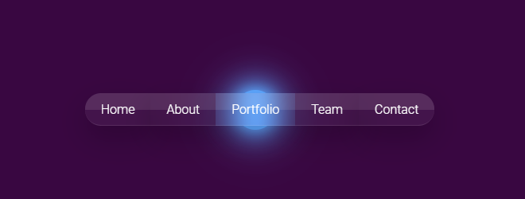
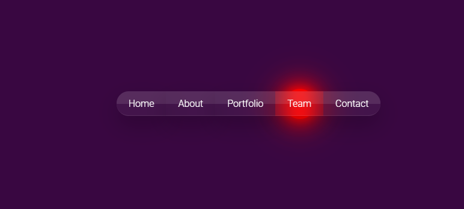

# Hello ! This is my portfolio !

Created with HTML5 , CSS3 and JavaScript, to show to YOU, a simple example of my abilities.

## About the techs that i used.

 

## Installing

There's no need to install, just download this repo, and run the index.html file.

## Snapshots

